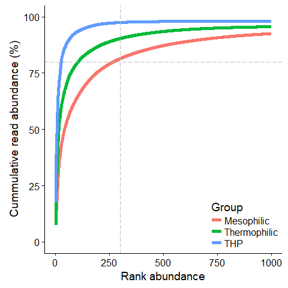

The impact of immigration on microbial community composition in full-scale anaerobic digesters
================
Rasmus Kirkegaard et al 2017
15-08-2017, Aalborg, Denmark

Project scope
=============

This project deals with the microbial analysis of full scale anaerobic digesters at wastewater treatment plants based on 16S rRNA gene amplicon sequencing. The bacterial part of the community has been sequenced using primers covering the V1-V3 region of the 16S rRNA gene. (27F (AGAGTTTGATCCTGGCTCAG, Lane 1991) and 534R (ATTACCGCGGCTGCTGG, Muyzer et al, 1993)). The Archaeal part of the community has been sequenced using primers covering the V3-V5 region of the 16S rRNA gene. (340F (CCCTAHGGGGYGCASCA, Pinto et al., 2012) and 915R (GWGCYCCCCCGYCAATTC, Pinto et al., 2012)). The data is available at figshare <https://dx.doi.org/10.6084/m9.figshare.4308191>.

Load libraries
--------------

``` r
library(knitr)
#library("devtools")
#install_github("MadsAlbertsen/ampvis")
library(ampvis)
library(cowplot)
library(plyr)
library(ggrepel)
library(plotly)
library(gridExtra)
library(grid)
```

Load data
---------

``` r
status<-try(load("data.RData"),silent = T)
```

    ## Warning in readChar(con, 5L, useBytes = TRUE): cannot open compressed file
    ## 'data.RData', probable reason 'No such file or directory'

``` r
 if(class(status)=="try-error") {
   rm(list = ls())
   print("Loading data from url")
   status<-try(load(url("https://s3-eu-west-1.amazonaws.com/pfigshare-u-files/7448392/data.RData")))
    if(class(status)=="try-error") {
      rm(list = ls())
      print("Loading data from scratch")
      knit("Load_data.Rmd")
    }
 }
```

    ## [1] "Loading data from url"

Sessioninfo
-----------

Print sessioninfo for reproducibility as R and package versions are known to make a difference (and occasionally conflicts).

``` r
sessionInfo()
```

    ## R version 3.4.0 (2017-04-21)
    ## Platform: x86_64-w64-mingw32/x64 (64-bit)
    ## Running under: Windows 10 x64 (build 15063)
    ## 
    ## Matrix products: default
    ## 
    ## locale:
    ## [1] LC_COLLATE=English_United Kingdom.1252 
    ## [2] LC_CTYPE=English_United Kingdom.1252   
    ## [3] LC_MONETARY=English_United Kingdom.1252
    ## [4] LC_NUMERIC=C                           
    ## [5] LC_TIME=English_United Kingdom.1252    
    ## 
    ## attached base packages:
    ##  [1] stats4    parallel  grid      stats     graphics  grDevices utils    
    ##  [8] datasets  methods   base     
    ## 
    ## other attached packages:
    ##  [1] plotly_4.7.0               plyr_1.8.4                
    ##  [3] cowplot_0.7.0              ampvis_1.27.0             
    ##  [5] scales_0.4.1               gridExtra_2.2.1           
    ##  [7] magrittr_1.5               dplyr_0.7.2               
    ##  [9] stringr_1.2.0              ggdendro_0.1-20           
    ## [11] DESeq2_1.16.1              SummarizedExperiment_1.6.3
    ## [13] DelayedArray_0.2.7         matrixStats_0.52.2        
    ## [15] Biobase_2.36.2             GenomicRanges_1.28.3      
    ## [17] GenomeInfoDb_1.12.2        data.table_1.10.4         
    ## [19] Biostrings_2.44.2          XVector_0.16.0            
    ## [21] IRanges_2.10.2             S4Vectors_0.14.3          
    ## [23] BiocGenerics_0.22.0        RColorBrewer_1.1-2        
    ## [25] igraph_1.1.2               vegan_2.4-3               
    ## [27] lattice_0.20-35            permute_0.9-4             
    ## [29] phyloseq_1.20.0            reshape2_1.4.2            
    ## [31] ggrepel_0.6.5              ggplot2_2.2.1             
    ## [33] knitr_1.16                
    ## 
    ## loaded via a namespace (and not attached):
    ##  [1] nlme_3.1-131            bitops_1.0-6           
    ##  [3] httr_1.2.1              rprojroot_1.2          
    ##  [5] tools_3.4.0             backports_1.1.0        
    ##  [7] R6_2.2.2                rpart_4.1-11           
    ##  [9] Hmisc_4.0-3             DBI_0.7                
    ## [11] lazyeval_0.2.0          mgcv_1.8-17            
    ## [13] colorspace_1.3-2        ade4_1.7-6             
    ## [15] nnet_7.3-12             compiler_3.4.0         
    ## [17] htmlTable_1.9           checkmate_1.8.2        
    ## [19] genefilter_1.58.1       digest_0.6.12          
    ## [21] foreign_0.8-67          rmarkdown_1.6          
    ## [23] base64enc_0.1-3         pkgconfig_2.0.1        
    ## [25] htmltools_0.3.6         htmlwidgets_0.8        
    ## [27] rlang_0.1.1             RSQLite_1.1-2          
    ## [29] bindr_0.1               jsonlite_1.5           
    ## [31] BiocParallel_1.10.1     acepack_1.4.1          
    ## [33] RCurl_1.95-4.8          GenomeInfoDbData_0.99.0
    ## [35] Formula_1.2-1           biomformat_1.4.0       
    ## [37] Matrix_1.2-9            Rcpp_0.12.12           
    ## [39] munsell_0.4.3           ape_4.1                
    ## [41] stringi_1.1.5           yaml_2.1.14            
    ## [43] MASS_7.3-47             zlibbioc_1.22.0        
    ## [45] rhdf5_2.20.0            splines_3.4.0          
    ## [47] multtest_2.32.0         annotate_1.54.0        
    ## [49] locfit_1.5-9.1          geneplotter_1.54.0     
    ## [51] codetools_0.2-15        XML_3.98-1.8           
    ## [53] glue_1.1.0              evaluate_0.10          
    ## [55] latticeExtra_0.6-28     foreach_1.4.3          
    ## [57] tidyr_0.6.3             gtable_0.2.0           
    ## [59] purrr_0.2.2.2           assertthat_0.2.0       
    ## [61] xtable_1.8-2            viridisLite_0.2.0      
    ## [63] survival_2.41-3         tibble_1.3.3           
    ## [65] iterators_1.0.8         AnnotationDbi_1.38.1   
    ## [67] memoise_1.1.0           bindrcpp_0.2           
    ## [69] cluster_2.0.6

**This was tested and working with:** R version 3.4.0 (2017-04-21) Platform: x86\_64-w64-mingw32/x64 (64-bit) Running under: Windows &gt;= 8 x64 (build 9200)

Matrix products: default

locale: \[1\] LC\_COLLATE=English\_United Kingdom.1252 LC\_CTYPE=English\_United Kingdom.1252 LC\_MONETARY=English\_United Kingdom.1252 \[4\] LC\_NUMERIC=C LC\_TIME=English\_United Kingdom.1252

attached base packages: \[1\] stats4 parallel grid stats graphics grDevices utils datasets methods base

other attached packages: \[1\] plotly\_4.7.0 plyr\_1.8.4 cowplot\_0.7.0 ampvis\_1.27.0 scales\_0.4.1
\[6\] gridExtra\_2.2.1 magrittr\_1.5 dplyr\_0.7.2 stringr\_1.2.0 ggdendro\_0.1-20
\[11\] DESeq2\_1.16.1 SummarizedExperiment\_1.6.3 DelayedArray\_0.2.7 matrixStats\_0.52.2 Biobase\_2.36.2
\[16\] GenomicRanges\_1.28.3 GenomeInfoDb\_1.12.2 data.table\_1.10.4 Biostrings\_2.44.2 XVector\_0.16.0
\[21\] IRanges\_2.10.2 S4Vectors\_0.14.3 BiocGenerics\_0.22.0 RColorBrewer\_1.1-2 igraph\_1.1.2
\[26\] vegan\_2.4-3 lattice\_0.20-35 permute\_0.9-4 phyloseq\_1.20.0 reshape2\_1.4.2
\[31\] ggrepel\_0.6.5 ggplot2\_2.2.1 knitr\_1.16 devtools\_1.13.2

loaded via a namespace (and not attached): \[1\] nlme\_3.1-131 bitops\_1.0-6 httr\_1.2.1 tools\_3.4.0 backports\_1.1.0
\[6\] R6\_2.2.2 rpart\_4.1-11 Hmisc\_4.0-3 DBI\_0.7 lazyeval\_0.2.0
\[11\] mgcv\_1.8-17 colorspace\_1.3-2 ade4\_1.7-6 nnet\_7.3-12 withr\_1.0.2
\[16\] curl\_2.6 compiler\_3.4.0 git2r\_0.18.0 htmlTable\_1.9 checkmate\_1.8.2
\[21\] genefilter\_1.58.1 digest\_0.6.12 foreign\_0.8-67 base64enc\_0.1-3 pkgconfig\_2.0.1
\[26\] htmltools\_0.3.6 htmlwidgets\_0.8 rlang\_0.1.1 RSQLite\_1.1-2 bindr\_0.1
\[31\] jsonlite\_1.5 BiocParallel\_1.10.1 acepack\_1.4.1 RCurl\_1.95-4.8 GenomeInfoDbData\_0.99.0 \[36\] Formula\_1.2-1 biomformat\_1.4.0 Matrix\_1.2-9 Rcpp\_0.12.11 munsell\_0.4.3
\[41\] ape\_4.1 stringi\_1.1.5 MASS\_7.3-47 zlibbioc\_1.22.0 rhdf5\_2.20.0
\[46\] splines\_3.4.0 multtest\_2.32.0 annotate\_1.54.0 locfit\_1.5-9.1 geneplotter\_1.54.0
\[51\] codetools\_0.2-15 XML\_3.98-1.8 glue\_1.1.0 latticeExtra\_0.6-28 foreach\_1.4.3
\[56\] tidyr\_0.6.3 purrr\_0.2.2.2 gtable\_0.2.0 assertthat\_0.2.0 xtable\_1.8-2
\[61\] viridisLite\_0.2.0 survival\_2.41-3 tibble\_1.3.3 iterators\_1.0.8 AnnotationDbi\_1.38.1
\[66\] memoise\_1.1.0 bindrcpp\_0.2 cluster\_2.0.6

Analyse the microbial data
==========================

Bacteria
--------

### Subset and filtering

The principle behind ampvis is that you first subset the data to what you want to look at using `phyloseq` and then visualise it using `ampvis`. Samples can be subset based on any available metadata. See the [phyloseq guide](http://joey711.github.io/phyloseq/tutorials-index) for more examples.

``` r
sample_variables(b_d)
```

Before we analyse the data it is often convenient to remove low abundant OTUs, as they are too noisy to result in meaningful conclusions. This can be done using the `filter_taxa` phyloseq function. Here we keep OTUs with an abundance of 0.1 % or more in at least one sample.

``` r
b_transformed<-transform_sample_counts(b_d, function(x) x / sum(x) * 100)
b_df <- filter_taxa(b_transformed, function(x) max(x) >= 0.1, TRUE)
remove(b_transformed)
```

``` r
foamsamples<-c("SA-RHK-527",
               "SA-RHK-529",
               "SA-RHK-531",
               "SA-RHK-1052",
               "SA-RHK-1053",
               "SA-RHK-1054",
               "SA-RHK-1055",
               "SA-RHK-1056",
               "SA-RHK-1075",
               "SA-RHK-1243",
               "SA-RHK-1244",
               "SA-RHK-1302",
               "SA-RHK-1339"
               )
```

Here we will use subset to select samples by variables in the metadata and store the data in the object b\_ads.

``` r
listof_ads<-c("Aalborg_West","Viborg","Fredericia","Damhusaaen","Randers","Herning","Fornaes","Aalborg_East","Aaby","Hjoerring","Soeholt","Slagelse","Ejby_Moelle","Bjergmarken","Lundtofte","Hobro","Avedoere","Naestved","Ringkoebing", "Esbjerg_West")
```

``` r
b_ads<- subset_samples(b_df, Sample_location %in% listof_ads & Temperature %in% c("THP","Mesophilic","Thermophilic") & !(Project_name %in% c("DNAextraction_optimisation_from_biogas","VTU_Case_study_-_GasMixCase_Viborg")))
```

Lets have a look at the data

``` r
amp_ordinate(data = b_ads)+theme_cowplot()+
  theme(plot.margin = unit(c(0,0,0,0), "mm"))
```


Let us add some information to see if we can see any patterns

``` r
amp_ordinate(data = b_ads,
             #plot.label = "SEQ_ID",
             plot.color = "Temperature",
             #plot.group.label = "Temperature",
             #plot.group.label.size = 7,
             plot.color.order = c("THP","Thermophilic","Mesophilic"))+theme_cowplot()+
  theme(plot.margin = unit(c(0,0,0,0), "mm"), legend.position="bottom")
```


There seems to be somewhat defined microbial communities with regard to the process types: Mesophilic, Thermophilic and THP. However, some of the samples seem to be clustering with the wrong groups. So I did some microbial detective work.

-   It turns out that Aaby was actually operating at mesophilic temperatures in 2011 even though they initially reported otherwise.
-   The mesophilic reactor in Herning is connected in series with the thermophilic reactor as influent, and is thus not representative for a "standard" mesophilic reactor.

It thus seems fair to remove these and samples like it for now.

``` r
skiplist<-c(foamsamples,"SA-RHK-921", "SA-RHK-1028","SA-RHK-1065","SA-RHK-1311","SA-RHK-19","SA-RHK-212")
#"SA-RHK-1028" (Sample from aaby 2011, where the plant was actually run with a mesophilic process)
#"SA-RHK-1065" (Sample from aaby 2011, where the plant was actually run with a mesophilic process)
#"SA-RHK-1311" (Sample from aaby 2015, what are they doing now???)
#"SA-RHK-921" (Sample from Herning when there was no info about reactor number)
#"Herning_M" is connected in series to a thermophilic plant and is thus not representative for a mesophilic plant 
skiplist2<-c(paste0("16SAMP-",9094:9147),paste0("16SAMP-",7593:7614),paste0("16SAMP-",8858:8867),paste0("16SAMP-",8984:8995),paste0("16SAMP-",8902:8903),"16SAMP-3461","16SAMP-3455","16SAMP-11802","16SAMP-11829","16SAMP-3464")

b_ads_s<- subset_samples(b_ads, !(SA_ID %in% skiplist) & !(Sample_location=="Herning" & Temperature=="Mesophilic") & (Investigator!="CHJ") & !(SEQ_ID %in% skiplist2) & !(Dataset=="CJH" & Temperature=="THP"))
```

Archaea
-------

``` r
a_df <- filter_taxa(a_d, function(x) max(x) >= 0.1, TRUE)
```

``` r
a_ads<- subset_samples(a_df, Sample_location %in% listof_ads & Temperature %in% c("THP","Mesophilic","Thermophilic") & !(Project_name %in% c("DNAextraction optimisation from biogas","VTU Case study - GasMixCase Viborg")))
```


The Archaea shows a clear cut between thermophilic reactors and mesophilic reactors (The THP reactors do also have a mesophilic process). Removing the samples that were identified to be wrongly classified before will make this trend even clearer.

``` r
a_ads_s<- subset_samples(a_ads, !(SA_ID %in% skiplist) & !(Sample_location=="Herning" & Temperature=="Mesophilic") & (Investigator!="CHJ"))
```

With the filtered dataset we can now proceed and prepare the figures in the paper

Main figures
============

Figure 1
--------

Panel figure with 4 PCA plots.

1.  Archaea separates by temperature
2.  Bacteria separates into 3 clusters
3.  Mesophilic bacteria cluster by plant?
4.  Thermophilic bacteria cluster by plant?

### Figure 1a

``` r
p1_a<-amp_ordinate(data = a_ads_s,
             plot.color = "Temperature",
             plot.group.label = "Temperature",
             plot.group.label.size = 7,
             plot.color.order = c("THP","Thermophilic","Mesophilic"))+theme_cowplot()+
  theme(plot.margin = unit(c(0,0,0,0), "mm"))+theme(legend.position="none")
```

### Figure 1b

``` r
p1_b<-amp_ordinate(data = b_ads_s,
             plot.color = "Temperature",
             plot.group.label = "Temperature",
             plot.group.label.size = 7,
             plot.color.order = c("THP","Thermophilic","Mesophilic")
             )+theme_cowplot()+
  theme(plot.margin = unit(c(0,0,0,0), "mm"))+theme(legend.position="none")
```

### Figure 1c

How do the samples group within the Mesophilic cluster?

### Figure 1d

How do the samples group within the Thermophilic cluster?

### Figure 1 combined

``` r
p1_am<-p1_a+ggtitle("Archaea")
p1_bm<-p1_b+ggtitle("Bacteria")
p1_cm<-p1_c+ggtitle("Bacteria - Mesophilic")
p1_dm<-p1_d+ggtitle("Bacteria - Thermophilic")
plot_grid(p1_am, p1_bm, p1_cm, p1_dm, align='vh',ncol = 2, labels=c('A', 'B', 'C', 'D'))
```


``` r
# Save the figure
#ggsave(filename = "Figure1.pdf",width = 10,height = 10, useDingbats = FALSE)
```

Figure 2
--------

Panel figure with 2 heatmaps.

1.  Phylum level heatmap for Archaea
2.  Genus level heatmap for Archaea

### Figure 2a

Phylum level heatmap for archaea

``` r
p2_a<-amp_heatmap(a_ads_s,tax.aggregate = "Phylum",tax.show = 5,group = c("Temperature","Sample_location"),color.vector = c("white","red"),plot.na = T)+
  facet_grid(~ Temperature,scales="free_x",space="free")+
  theme(plot.margin = unit(c(0,0,0,0), "mm"),
        axis.text.y = element_text(color = "black"),
        strip.text.x = element_text(color = "black"),
        axis.text.x = element_text(vjust=0.5,color = "black"),legend.position="none")

# Change labels
original_labels<-levels(p2_a$data$Group)
new_labels <- toupper(sub(".*? ", "", original_labels))
p2_a$data$Group.label<-mapvalues(p2_a$data$Group,original_labels,c(new_labels)) 
p2_a<-p2_a+aes(x=p2_a$data$Group.label)+theme(axis.title.x=element_blank())
```

### Figure 2b

Genus level heatmap for Archaea

``` r
p_temp<-amp_heatmap(a_ads_s,tax.aggregate = "Genus",tax.add = c("Phylum"),tax.empty = "OTU",tax.show = 20,group = c("Temperature","Sample_location"),color.vector = c("white","red"),plot.na = T)+
  facet_grid(~ Temperature,scales="free_x",space="free")+
  theme(plot.margin = unit(c(0,0,0,0), "mm"),
        axis.text.y = element_text(color = "black"),
        strip.text.x = element_text(color = "black"),
        axis.text.x = element_text(vjust=0.5,color = "black"),legend.position="none")

# Change labels
original_labels<-levels(p_temp$data$Group)
new_labels <- toupper(sub(".*? ", "", original_labels))
p_temp$data$Group.label<-mapvalues(p_temp$data$Group,original_labels,c(new_labels)) 
p2_b<-p_temp+aes(x=p_temp$data$Group.label)+theme(axis.title.x=element_blank())
```

### Figure 2 combined

``` r
plot_grid(p2_a, p2_b, align='vh',ncol = 1, labels=c('A', 'B'),rel_heights = c(4,9))
```


``` r
# Save the figure
#ggsave(filename = "Figure2.pdf",width = 18,height = 13, useDingbats = FALSE)
```

Figure 3
--------

Panel figure with 2 heatmaps.

1.  Phylum level heatmap for bacteria
2.  Genus level heatmap for bacteria

### Figure 3a

Phylum level heatmap for bacteria

``` r
p3_a<-amp_heatmap(b_ads_s,tax.aggregate = "Phylum",tax.show = 20,group = c("Temperature","Sample_location"),color.vector = c("white","red"),plot.na = T)+
  facet_grid(~ Temperature,scales="free_x",space="free")+
  theme(plot.margin = unit(c(0,0,0,0), "mm"),
        axis.text.y = element_text(color = "black"),
        strip.text.x = element_text(color = "black"),
        axis.text.x = element_text(vjust=0.5,color = "black"),legend.position="none")

# Change labels
original_labels<-levels(p3_a$data$Group)
new_labels <- toupper(sub(".*? ", "", original_labels))
p3_a$data$Group.label<-mapvalues(p3_a$data$Group,original_labels,c(new_labels)) 
p3_a<-p3_a+aes(x=p3_a$data$Group.label)+theme(axis.title.x=element_blank())
```

### Figure 3b

Heatmap of top 20 genera in anaerobic digesters

``` r
p3_b<-amp_heatmap(b_ads_s,tax.aggregate = "Genus",tax.add = c("Phylum"),tax.empty = "OTU",tax.show = 20,group = c("Temperature","Sample_location"),color.vector = c("white","red"),plot.na = T)+
  facet_grid(~ Temperature,scales="free_x",space="free")+
  theme(plot.margin = unit(c(0,0,0,0), "mm"),
        axis.text.y = element_text(color = "black"),
        strip.text.x = element_text(color = "black"),
        axis.text.x = element_text(vjust=0.5,color = "black"),legend.position="none")
# Change labels
original_labels<-levels(p3_b$data$Group)
new_labels <- toupper(sub(".*? ", "", original_labels))
p3_b$data$Group.label<-mapvalues(p3_b$data$Group,original_labels,c(new_labels)) 
p3_b<-p3_b+aes(x=p3_b$data$Group.label)+theme(axis.title.x=element_blank())
```

### Figure 3 combined

``` r
plot_grid(p3_a, p3_b, align='vh',ncol = 1, labels=c('A', 'B'),rel_heights = c(1,1))
```


``` r
# Save the figure
#ggsave(filename = "Figure3.pdf",width = 18,height = 13, useDingbats = FALSE)
```

Figure 4
--------

Panel figure with 2 heatmaps.

1.  Genus level heatmap for bacteria sorted by abundance in influent streams
2.  Genus level heatmap for bacteria sorted by abundance in digesters

``` r
n_taxa<-20
b_ads_sFig5_sel<- subset_samples(b_df, !(SA_ID %in% skiplist) & !(Sample_location=="Herning" & Temperature=="Mesophilic") & (Investigator!="CHJ")  & !(SEQ_ID %in% skiplist2) & order_type!="empty" & simple_var3!="empty" & Sample_type!="Effluent" & !(Dataset=="CJH" & Temperature=="THP"))

# Sorted by influent abundance
b_ads_sFig5_sel_sort<- subset_samples(b_df, !(SA_ID %in% skiplist) & !(Sample_location=="Herning" & Temperature=="Mesophilic") & (Investigator!="CHJ") &  !(SEQ_ID %in% skiplist2) & order_type %in% c("1_primary","2_surplus") & !(Dataset=="CJH" & Temperature=="THP"))

p<-amp_heatmap(b_ads_sFig5_sel_sort,tax.aggregate = "Genus",tax.add = c("Phylum"),tax.empty = "OTU",tax.show = n_taxa,
            color.vector = c("white","red"))

gvf<-rev(levels(p$data$Display))[1:n_taxa]
sort<-rev(gvf)

p_temp<-amp_heatmap(b_ads_sFig5_sel,group = "simple_var3",tax.aggregate = "Genus",tax.add = c("Phylum"),tax.empty = "OTU",tax.show = sort,order.y = sort,plot.na = T, color.vector = c("white","red"))

# Change labels
original_labels<-levels(p_temp$data$Group)
new_labels <- toupper(sub(".*? ", "", original_labels))
p_temp$data$Group.label<-mapvalues(p_temp$data$Group,original_labels,c(new_labels)) 
p5_a<-p_temp+aes(x=p_temp$data$Group.label)+theme(axis.title.x=element_blank(),legend.position="none",axis.text.x = element_text(vjust=0.5,color = "black"))

# Sorted by digester abundance
b_ads_sFig5_sel_sort<- subset_samples(b_df, !(SA_ID %in% skiplist) & !(Sample_location=="Herning" & Temperature=="Mesophilic") & (Investigator!="CHJ") &  !(SEQ_ID %in% skiplist2) & simple_var3 %in% c("c) Mesophilic","d) Thermophilic") & !(Dataset=="CJH" & Temperature=="THP"))

p<-amp_heatmap(b_ads_sFig5_sel_sort,tax.aggregate = "Genus",tax.add = c("Phylum"),tax.empty = "OTU",tax.show = n_taxa,
            color.vector = c("white","red"))

gvf<-rev(levels(p$data$Display))[1:n_taxa]
sort<-rev(gvf)

p_temp<-amp_heatmap(b_ads_sFig5_sel,group = "simple_var3",tax.aggregate = "Genus",tax.add = c("Phylum"),tax.empty = "OTU",tax.show = sort,order.y = sort,plot.na = T, color.vector = c("white","red"))

# Change labels
original_labels<-levels(p_temp$data$Group)
new_labels <- toupper(sub(".*? ", "", original_labels))
p_temp$data$Group.label<-mapvalues(p_temp$data$Group,original_labels,c(new_labels)) 
p5_b<-p_temp+aes(x=p_temp$data$Group.label)+theme(axis.title.x=element_blank(),legend.position="none",axis.text.x = element_text(vjust=0.5,color = "black"))


plot_grid(p5_a, p5_b, align='vh',ncol = 2, labels=c('A', 'B'))
```


``` r
# Save the figure
# fname<-paste0("Figure4.pdf")
#ggsave(filename = fname,width = 13,height = 7, useDingbats = FALSE)
```

Calculate ratios

``` r
reactors<-c("Mesophilic","Thermophilic","THP")
ratiodf<-data.frame(RATIO=double(), res_RT.tag=character(), res_RT.Mean=double(), T_reactor=character())
ratiodf_h<-data.frame(init=1337)
for (T_reactor in reactors) {

####
# Digester
###
d_sel<- subset_samples(b_ads_s, Temperature==T_reactor)

res<-data.frame("tag"=names(apply(otu_table(d_sel), 1, mean)),"Mean"=apply(otu_table(d_sel), 1, mean))

res_RT<-res

####
# For influent
###
d_sel<- subset_samples(b_df, Sample_type=="Influent")

res<-data.frame("tag"=names(apply(otu_table(d_sel), 1, mean)),"Mean"=apply(otu_table(d_sel), 1, mean))

res_inf<-res
####
# Surplus sludge
###
d_sel<- subset_samples(b_df, simple_var3=="b) Surplus sludge")

res<-data.frame("tag"=names(apply(otu_table(d_sel), 1, mean)),"Mean"=apply(otu_table(d_sel), 1, mean))

res_AS<-res

# Calculate ratio and plot
options(scipen = 8)
RATIO_inf<-res_RT$Mean/res_inf$Mean
RATIO_AS<-res_RT$Mean/res_AS$Mean
RATIO<-apply(cbind(RATIO_inf,RATIO_AS),1,min)

mydf<-data.frame(RATIO,res_RT$tag,res_RT$Mean)


# For creating a table of all the abundance values
tempdf<-cbind(mydf,T_reactor)
tempdf$Frequency<-tempdf$res_RT.Mean/sum(tempdf$res_RT.Mean)
ratiodf<-rbind(ratiodf,tempdf)
ratiodf_h<-cbind(ratiodf_h,mydf)
}
```

``` r
ratiodf_h<-ratiodf_h[,c(3,2,5,8,4,7,10)]
colnames(ratiodf_h)<-c("OTU",paste0("RATIO.",reactors),paste0("Meanabundance.",reactors))
rownames(ratiodf_h)<-ratiodf_h$OTU
finalfram<-merge(ratiodf_h,taxinfo,by="row.names",all.x=TRUE) # Merge taxonomy and ratio dataframes
maxabundance<-apply(X = finalfram[,c("Meanabundance.Mesophilic","Meanabundance.Thermophilic","Meanabundance.THP")], MARGIN = 1,FUN = "max") # Calcuclate maximum (mean) abundance
maxratio<-apply(X = finalfram[,c("RATIO.Mesophilic","RATIO.Thermophilic","RATIO.THP")], MARGIN = 1,FUN = "max") # Calculate maximum ratio
finalframe<-cbind(finalfram,maxabundance,maxratio)            # Combine 
newdata <- finalframe[order(maxabundance,decreasing = T),]    # Order the OTUs by abundance
newdata_lim<-newdata[which(newdata$maxabundance>0),c(3:14,2)] # Remove OTUs with an abundance of 0 and select which columns to save

# Save data
#write.csv(newdata_lim,file = "tableS2.csv",row.names = F)
```

Figure 5
--------

Distributions of digester to influent abundance ratios for the three reactor types (Mesophilic, thermophlic and THP)

``` r
ggplot(ratiodf)+
  geom_line(aes(x=RATIO,y=(..density..),weight=Frequency, colour = T_reactor),size = 2, stat="density")+
  ylab(label = "Density\n(weighted by abundance)")+
  scale_x_log10(breaks = c(0.1,1,10,100,1000))+
  theme(legend.title=element_blank(),legend.position = "bottom")
```


``` r
# Save the figure
#ggsave(filename = "Figure5.pdf",width = 10,height = 7, useDingbats = FALSE)
```

Supplementary figures
=====================

Figure S1
---------

OTU level heatmap for Archaea

``` r
p_temp<-amp_heatmap(a_ads_s,tax.aggregate = "OTU",tax.add = c("Phylum","Genus"),tax.empty = "OTU",tax.show = 20,group = c("Temperature","Sample_location"),color.vector = c("white","red"),plot.na = T)+
  facet_grid(~ Temperature,scales="free_x",space="free")+
  theme(plot.margin = unit(c(0,0,0,0), "mm"),
        axis.text.y = element_text(color = "black"),
        strip.text.x = element_text(color = "black"),
        axis.text.x = element_text(vjust=0.5,color = "black"),legend.position="none")

# Change labels
original_labels<-levels(p_temp$data$Group)
new_labels <- toupper(sub(".*? ", "", original_labels))
p_temp$data$Group.label<-mapvalues(p_temp$data$Group,original_labels,c(new_labels)) 
p_temp+aes(x=p_temp$data$Group.label)+theme(axis.title.x=element_blank())
```


``` r
# Save figure
#ggsave(filename = "FigureS1.pdf",width = 18,height = 9, useDingbats = FALSE)
```

Figure S2
---------

Diversity indeces plots

``` r
# Bacteria
b_ads_unfiltered<- subset_samples(b_d, Sample_location %in% listof_ads & Temperature %in% c("THP","Mesophilic","Thermophilic") & !(Project_name %in% c("DNAextraction_optimisation_from_biogas","VTU_Case_study_-_GasMixCase_Viborg")) & !(SA_ID %in% skiplist) & !(Sample_location=="Herning" & Temperature=="Mesophilic") & (Investigator!="CHJ") & !(SEQ_ID %in% skiplist2) & !(Dataset=="CJH" & Temperature=="THP"))

# Archaea
a_ads_unfiltered<-subset_samples(a_d, Sample_location %in% listof_ads & Temperature %in% c("THP","Mesophilic","Thermophilic") & !(Project_name %in% c("DNAextraction optimisation from biogas","VTU Case study - GasMixCase Viborg")) & !(SA_ID %in% skiplist) & !(Sample_location=="Herning" & Temperature=="Mesophilic") & (Investigator!="CHJ"))
```

``` r
# plots
pS2_a<-plot_richness(b_ads_unfiltered, x="Temperature", measures=c("Shannon"))+xlab("Reactor type")+ylim(c(0,7))+theme(axis.text.x = element_text(angle = 90, hjust = 1))

pS2_b<-plot_richness(a_ads_unfiltered, x="Temperature", measures=c("Shannon"))+xlab("Reactor type")+ylim(c(0,7))+theme(axis.text.x = element_text(angle = 90, hjust = 1))

pS2_c<-plot_richness(b_ads_unfiltered, x="Temperature", measures=c("Simpson"))+xlab("Reactor type")+ylim(c(0,1))+theme(axis.text.x = element_text(angle = 90, hjust = 1))

pS2_d<-plot_richness(a_ads_unfiltered, x="Temperature", measures=c("Simpson"))+xlab("Reactor type")+ylim(c(0,1))+theme(axis.text.x = element_text(angle = 90, hjust = 1))

pS2_a<-pS2_a+ggtitle("Bacteria")
pS2_b<-pS2_b+ggtitle("Archaea")
pS2_c<-pS2_c+ggtitle("Bacteria")
pS2_d<-pS2_d+ggtitle("Archaea")

plot_grid(pS2_a, pS2_b, pS2_c, pS2_d, align='vh',ncol = 2, labels=c('A', 'B', 'C','D'))
```


``` r
# Save figure
#ggsave(filename = "FigureS2.pdf",width = 10,height = 10, useDingbats = FALSE)
```

Figure S3
---------

OTU level heatmap for Bacteria

``` r
p_temp<-amp_heatmap(b_ads_s,tax.aggregate = "OTU",tax.add = c("Phylum","Genus"),tax.empty = "empty",tax.show = 20,group = c("Temperature","Sample_location"),color.vector = c("white","red"),plot.na = T)+
  facet_grid(~ Temperature,scales="free_x",space="free")+
  theme(plot.margin = unit(c(0,0,0,0), "mm"),
        axis.text.y = element_text(color = "black"),
        strip.text.x = element_text(color = "black"),
        axis.text.x = element_text(vjust=0.5,color = "black"),legend.position="none")

# Change labels
original_labels<-levels(p_temp$data$Group)
new_labels <- toupper(sub(".*? ", "", original_labels))
p_temp$data$Group.label<-mapvalues(p_temp$data$Group,original_labels,c(new_labels)) 
p_temp+aes(x=p_temp$data$Group.label)+theme(axis.title.x=element_blank())
```


``` r
# Save figure
#ggsave(filename = "FigureS3.pdf",width = 18,height = 9, useDingbats = FALSE)
```

Figure S4
---------

Heatmap with classification of OTUs based on their ratios

``` r
newdata$RATIOGROUP<-"empty"
newdata$RATIOGROUP[which(newdata$maxratio>1)]<-"VAR" # 1
newdata$RATIOGROUP[which(newdata$maxratio>10)]<-"POS" # 10
newdata$RATIOGROUP[which(newdata$maxratio<1)]<-"NEG" # 1
ratiofuncttable<-newdata[,c("OTU","RATIOGROUP")]
row.names(ratiofuncttable) <- NULL 
names(ratiofuncttable)[1]<-"Genus"
```

``` r
nshow<-100
p1 <- amp_heatmap(data = b_ads_s,
                  c("Temperature","Sample_location"), 
                  tax.aggregate = "OTU", 
                  tax.add=c("Phylum","Class","Order","Family","Genus"),
                  tax.show=nshow, 
                  plot.na =T,
                  plot.colorscale = "log",
                  color.vector = c("white","red")) + 
  facet_grid(~ Temperature,scales="free_x",space="free")+
  theme(plot.margin = unit(c(0,0,0,0), "mm"),
        axis.text.y = element_text(color = "black"),
        strip.text.x = element_text(color = "black"),
        axis.text.x = element_text(vjust=0.5,color = "black"),legend.position="none")
# Change labels
original_labels<-levels(p1$data$Group)
new_labels <- toupper(sub(".*? ", "", original_labels))
p1$data$Group.label<-mapvalues(p1$data$Group,original_labels,c(new_labels)) 
p1<-p1+aes(x=p1$data$Group.label)+theme(axis.title.x=element_blank())

p2<-amp_function(p1,adjust = 0,genus.pos = 6,functions = ratiofuncttable, selection = "RATIOGROUP")+theme(legend.position="none",plot.margin = unit(c(10,0,0,0), "mm"))
grid.arrange(p1, p2, nrow = 1, widths = c(0.95, 0.05))

p <- arrangeGrob(p1, p2, nrow=1,widths = c(0.95,0.05))
grid.draw(p) # interactive device works
```


``` r
# Save figure
#ggsave(filename = "FigureS4.pdf",plot = p,width = 20,height = 45, useDingbats = FALSE)
```

Figure S5
---------

Rank abundance curves for the three digester types (mesophilic, thermophilic and THP)

``` r
ps1_c<-amp_rabund(b_ads_s,group = "Temperature",plot.type = "curve")+xlim(0,1000)+theme(legend.justification=c(1,0), legend.position=c(1,0))
ps1_c+geom_vline(xintercept =300,colour="grey", linetype = "longdash")+geom_hline(yintercept = 80,colour="grey", linetype = "longdash")
```



``` r
# Save figure
#ggsave(filename = "FigureS5.pdf",width = 5,height = 5, useDingbats = FALSE)
```

Figure S6
---------

PCA plot of all the samples coloured by sample type

``` r
b_sel<- subset_samples(b_df, simple_var3!="empty" & !(SA_ID %in% skiplist) & !(Sample_location=="Herning" & Temperature=="Mesophilic") & (Investigator!="CHJ") & !(SEQ_ID %in% skiplist2) & !(Dataset=="CJH" & Temperature=="THP") & !(Project_name %in% c("DNAextraction_optimisation_from_biogas","VTU_Case_study_-_GasMixCase_Viborg")))
# Make labels prettier
sample_data(b_sel)$simple_var3<-gsub(".) ", "", sample_data(b_sel)$simple_var3)
pS6<-amp_ordinate(b_sel,
             plot.color = "simple_var3",
             plot.group.label = "simple_var3",
             plot.group.label.size = 7)+
  theme_cowplot()+
  theme(plot.margin = unit(c(0,0,0,0), "mm"))+
  theme(legend.position="none")
pS6
```


``` r
# Save the figure
# fname<-paste0("FigureS6.pdf")
```

Figure S7
---------

Heatmap of the organisms in the primary sludge

``` r
PS<-subset_samples(b_df, simple_var3=="a) Primary sludge")

p_temp<-amp_heatmap(PS,tax.aggregate = "Genus",tax.add = c("Phylum"),tax.empty = "OTU",tax.show = 20,group = c("Sample_location"),color.vector = c("white","red"),plot.na = T)+
  theme(plot.margin = unit(c(0,0,0,0), "mm"),
        axis.text.y = element_text(color = "black"),
        strip.text.x = element_text(color = "black"),
        axis.text.x = element_text(vjust=0.5,color = "black"),legend.position="none")
# Change labels
original_labels<-levels(p_temp$data$Group)
new_labels <- toupper(sub(".*? ", "", original_labels))
p_temp$data$Group.label<-mapvalues(p_temp$data$Group,original_labels,c(new_labels)) 
p_temp+aes(x=p_temp$data$Group.label)+theme(axis.title.x=element_blank())
```


``` r
# Save the figure
#ggsave(filename = "FigureS7.pdf",width = 17,height = 7, useDingbats = FALSE)
```

Figure S8
---------

Heatmap of organisms in the surplus sludge

``` r
AS<-subset_samples(b_df, simple_var3=="b) Surplus sludge")

p_temp<-amp_heatmap(AS,tax.aggregate = "Genus",tax.add = c("Phylum"),tax.empty = "OTU",tax.show = 20,group = c("Sample_location"),color.vector = c("white","red"),plot.na = T)+
  theme(plot.margin = unit(c(0,0,0,0), "mm"),
        axis.text.y = element_text(color = "black"),
        strip.text.x = element_text(color = "black"),
        axis.text.x = element_text(vjust=0.5,color = "black"),legend.position="none")
# Change labels
original_labels<-levels(p_temp$data$Group)
new_labels <- toupper(sub(".*? ", "", original_labels))
p_temp$data$Group.label<-mapvalues(p_temp$data$Group,original_labels,c(new_labels)) 
p_temp+aes(x=p_temp$data$Group.label)+theme(axis.title.x=element_blank())
```


``` r
# Save the figure
#ggsave(filename = "FigureS8.pdf",width = 17,height = 7, useDingbats = FALSE)
```

Figure S9
---------

Distributions of digester to influent abundance ratios for for individual plants w. many samples

``` r
plant<-"Viborg"
plants<-c("Viborg","Fredericia","Aalborg_West","Bjergmarken","Ejby_Moelle")
ratiodf_sel<-data.frame(RATIO=double(), res_RT.tag=character(), res_RT.Mean=double(), plant=character())
for (plant in plants) {


####
# Digester
###
d_sel<- subset_samples(b_ads_s, Sample_location==plant)

res<-data.frame("tag"=names(apply(otu_table(d_sel), 1, mean)),"Mean"=apply(otu_table(d_sel), 1, mean))

res_RT<-res

####
# For influent
###
d_sel<- subset_samples(b_df, Sample_type=="Influent" & Sample_location==plant)

res<-data.frame("tag"=names(apply(otu_table(d_sel), 1, mean)),"Mean"=apply(otu_table(d_sel), 1, mean))

res_inf<-res
####
# Surplus sludge
###
d_sel<- subset_samples(b_df, simple_var3=="b) Surplus sludge" & Sample_location==plant)

res<-data.frame("tag"=names(apply(otu_table(d_sel), 1, mean)),"Mean"=apply(otu_table(d_sel), 1, mean))

res_AS<-res

# Calculate ratio and plot
options(scipen = 8)
RATIO_inf<-res_RT$Mean/res_inf$Mean
RATIO_AS<-res_RT$Mean/res_AS$Mean
RATIO<-apply(cbind(RATIO_inf,RATIO_AS),1,min)

mydf<-data.frame(RATIO,res_RT$tag,res_RT$Mean)


# For creating a table of all the abundance values
tempdf<-cbind(mydf,plant)
tempdf$Frequency<-tempdf$res_RT.Mean/sum(tempdf$res_RT.Mean)
ratiodf_sel<-rbind(ratiodf_sel,tempdf)
}
```

``` r
ggplot(ratiodf_sel)+
  geom_line(aes(x=RATIO,y=(..density..),weight=Frequency, colour = plant),size = 2, stat="density")+
  ylab(label = "Density\n(weighted by abundance)")+
  scale_x_log10(breaks = c(0.1,1,10,100,1000))+
  theme(legend.title=element_blank(),legend.position = "bottom")
```


``` r
# Save the figure
#ggsave(filename = "FigureS9.pdf",width = 10,height = 7, useDingbats = FALSE)
```

Figure S10
----------

OTUs within Gelria are different between mesophilic and thermophilic!

``` r
gelria<-subset_taxa(b_ads_s, Genus=="g__Gelria")

p_temp<-amp_heatmap(gelria,tax.aggregate = "OTU",tax.show = 15,tax.add = "Genus",group = c("Temperature","Sample_location"),color.vector = c("white","red"),plot.na = T)+
  facet_grid(~ Temperature,scales="free_x",space="free")+
  theme(plot.margin = unit(c(0,0,0,0), "mm"),
        axis.text.y = element_text(color = "black"),
        strip.text.x = element_text(color = "black"),
        axis.text.x = element_text(vjust=0.5,color = "black"),legend.position="none")
# Change labels
original_labels<-levels(p_temp$data$Group)
new_labels <- toupper(sub(".*? ", "", original_labels))
p_temp$data$Group.label<-mapvalues(p_temp$data$Group,original_labels,c(new_labels)) 
p_temp+aes(x=p_temp$data$Group.label)+theme(axis.title.x=element_blank())
```


``` r
# Save the figure
#ggsave(filename = "FigureS10.pdf",width = 10,height = 7, useDingbats = FALSE)
```

Figure S11
----------

Timeseries for the reactor in Viborg during the survey

``` r
b_ads_s_vib<- subset_samples(b_df, Sample_location=="Viborg" & Temperature %in% c("Mesophilic") & !(Project_name %in% c("DNAextraction_optimisation_from_biogas","VTU_Case_study_-_GasMixCase_Viborg")) & !(SA_ID %in% skiplist) & (Investigator!="CHJ") & !(SEQ_ID %in% skiplist2) )

pS11_a<-amp_heatmap(b_ads_s_vib,tax.aggregate = "Genus",tax.add = c("Phylum"),tax.empty = "OTU",tax.show = 20,group = c("Collection_date"),color.vector = c("white","red"),plot.na = T)+
  #facet_grid(~ Temperature,scales="free_x",space="free")+
  theme(plot.margin = unit(c(0,0,0,0), "mm"),
        axis.text.y = element_text(color = "black"),
        strip.text.x = element_text(color = "black"),
        axis.text.x = element_text(vjust=0.5,color = "black"),legend.position="none")+xlab("Sample date\n(yyyymmdd)")

b_ads_s_aaw<- subset_samples(b_df, Sample_location=="Aalborg_West" & Temperature %in% c("Thermophilic") & !(Project_name %in% c("DNAextraction_optimisation_from_biogas","VTU_Case_study_-_GasMixCase_Viborg")) & !(SA_ID %in% skiplist) & (Investigator!="CHJ") & !(SEQ_ID %in% skiplist2) )

pS11_b<-amp_heatmap(b_ads_s_aaw,tax.aggregate = "Genus",tax.add = c("Phylum"),tax.empty = "OTU",tax.show = 20,group = c("Collection_date"),color.vector = c("white","red"),plot.na = T)+
  #facet_grid(~ Temperature,scales="free_x",space="free")+
  theme(plot.margin = unit(c(0,0,0,0), "mm"),
        axis.text.y = element_text(color = "black"),
        strip.text.x = element_text(color = "black"),
        axis.text.x = element_text(vjust=0.5,color = "black"),legend.position="none")+xlab("Sample date\n(yyyymmdd)")

#
plot_grid(pS11_a, pS11_b, align='vh',ncol = 1, labels=c('A', 'B'))
```


``` r
# Save the figure
#ggsave(filename = "FigureS11.pdf",width = 10,height = 10, useDingbats = FALSE)
```
